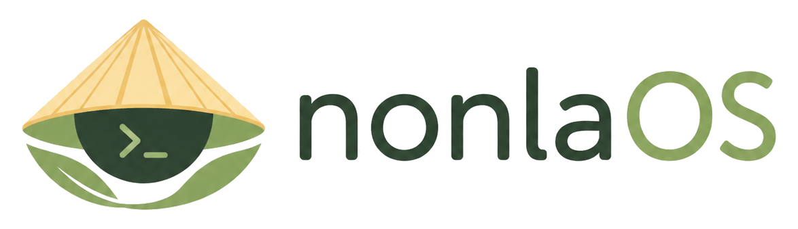

<p align="center">
  
</p>

# nonlaOS

[](https://github.com/NonLaProject/nonlaOS/actions/workflows/package-build.yml)
[](https://github.com/NonLaProject/nonlaOS/actions/workflows/build-iso.yml)

nonlaOS là dự án Linux desktop tiếng Việt dựa trên Debian stable, dùng KDE
Plasma, hướng tới người chuyển từ Windows sang Linux.

Dự án ưu tiên cách làm có thể kiểm chứng và lặp lại: mọi thay đổi hệ thống được
đóng gói thành Debian package, phân phối qua APT repo, rồi mới đưa vào ISO. Repo
này là nền móng packaging/source đầu tiên của nonlaOS, chưa phải bản ISO hoàn
chỉnh cho người dùng cuối.

## Mục tiêu

MVP 0.1 tập trung vào một hệ desktop tối thiểu nhưng đúng quy trình:

- Debian stable làm base.
- KDE Plasma làm desktop mặc định.
- Hỗ trợ tiếng Việt, bộ gõ và font phù hợp.
- Cài sẵn các ứng dụng desktop cơ bản cho người mới chuyển từ Windows.
- Có nhận diện nonlaOS đầu tiên qua wallpaper, color scheme, SDDM và Plymouth.
- Có Calamares để chuẩn bị luồng cài đặt.
- Build package, repo và ISO theo hướng reproducible.

## Nguyên tắc kỹ thuật

- Không đưa phần mềm lậu, crack, keygen hoặc asset không rõ license vào repo.
- Không sửa ISO thủ công.
- Không coi theme, cấu hình hoặc branding là “file copy tay”; mọi thay đổi phải
  đi qua Debian package.
- Tối ưu cho khả năng review, rollback và update bằng APT.
- Ưu tiên Debian stable và package chính thống trước khi thêm dependency ngoài.

## Cấu trúc repo

```text
packages/
  nonla-desktop/             Metapackage cho desktop stack cơ bản
  nonla-look/                Wallpaper, KDE color scheme, SDDM, Plymouth
  nonla-branding/            Branding hệ thống sau này
  nonla-default-settings/    Cấu hình mặc định người dùng sau này
  nonla-calamares-config/    Cấu hình installer sau này
  nonla-welcome/             Welcome app sau này
  nonla-repo-keyring/        Keyring cho APT repo sau này
docs/                        Roadmap, testing, packaging notes, architecture
img/                         Asset nội bộ của nonlaOS
tools/                       Script build package, APT repo và ISO
iso/                         Cấu hình live-build cho ISO nonlaOS
artwork/                     Không gian chuẩn bị cho artwork source sau này
```

## Package hiện có

`nonla-desktop` là metapackage kéo desktop stack KDE Plasma cơ bản cùng các
package nhận diện/cấu hình của nonlaOS. Nó phụ thuộc vào `nonla-branding`,
`nonla-look`, `nonla-default-settings`, SDDM, Calamares, Firefox ESR,
LibreOffice, Dolphin, Konsole, Kate, Okular, Ark, Gwenview, Noto fonts, FCITX5,
FCITX5 Unikey và UFW. Package `kcm-fcitx5` được khai báo `Recommends` vì tên gói
có thể khác nhau giữa các nhánh Debian hoặc mirror.

`nonla-branding` ship logo, icon và metadata nhận diện riêng của nonlaOS:

- `/usr/share/nonlaos/branding/nonlaos-release`
- `/usr/share/nonlaos/branding/boot_logo.png`
- `/usr/share/nonlaos/branding/launcher_icon.png`
- `/usr/share/pixmaps/nonlaos.png`
- `/usr/share/icons/hicolor/256x256/apps/nonlaos.png`

Package này chưa thay thế `/etc/os-release` hoặc `/usr/lib/os-release`; phần đó
sẽ xử lý riêng trong ISO/live-build hoặc package `base-files` riêng sau này.

`nonla-look` là payload nhận diện đầu tiên của nonlaOS. Package này dùng asset
nội bộ từ `img/` để ship:

- KDE wallpaper `nonlaOS Default`
- KDE color scheme `Nonla`
- Plasma look-and-feel skeleton
- SDDM theme skeleton
- Plymouth theme skeleton

Icon app `nonlaos` thuộc package `nonla-branding` để tránh hai package cùng sở
hữu một đường dẫn icon.

`nonla-default-settings` ship cấu hình mặc định cho user mới:

- seed KDE Plasma config qua `/etc/skel`
- đặt wallpaper `nonla-default` và color scheme `Nonla`
- seed panel Plasma cơ bản với launcher icon `nonlaos`
- bật FCITX5 qua `/etc/environment.d/90-nonla-input.conf`
- autostart FCITX5 và seed profile ưu tiên Unikey

Package này chỉ áp dụng cho user được tạo sau khi package đã cài. Nó không ghi
đè home directory hoặc config của user hiện có.

Các package còn lại hiện là skeleton có chủ đích để giữ ownership packaging cho
các bước tiếp theo.

## Build packages

Trên Debian/WSL, cài dependency build:

```bash
sudo apt-get update
sudo apt-get install -y build-essential devscripts dpkg-dev debhelper lintian
```

Build toàn bộ package:

```bash
./tools/build-packages.sh
```

Output nằm trong:

```text
dist/packages/
```

Lint package:

```bash
lintian dist/packages/*.deb
```

Một số package skeleton có thể còn warning `empty-binary-package`; xem
[Packaging notes](docs/PACKAGING_NOTES.md) để biết warning nào đang được chấp
nhận tạm thời.

## Build APT repository

Cài dependency để tạo APT repository metadata:

```bash
sudo apt install dpkg-dev apt-utils gzip
```

Build package rồi tạo repo:

```bash
./tools/build-packages.sh
./tools/make-repo.sh
```

Output nằm trong:

```text
dist/repo/
```

Test local repo bằng `file://`:

```bash
REPO_PATH="$(pwd)/dist/repo"

echo "deb [trusted=yes] file:${REPO_PATH} stable main" | sudo tee /etc/apt/sources.list.d/nonla-local.list

sudo apt update
apt-cache policy nonla-desktop
```

Ví dụ cấu hình public repo khi deploy:

```text
deb [trusted=yes] https://YOUR_EXISTING_REPO_DOMAIN/path/to/repo stable main
```

Domain thật được cấu hình khi deploy lên hạ tầng repo hiện có. Domain riêng cho
nonlaOS sẽ xử lý sau, và source repo không hardcode URL public.

Repo hiện chưa ký GPG. Bước sau sẽ xử lý `nonla-repo-keyring` và tạo
`InRelease`/`Release.gpg`; `[trusted=yes]` chỉ dùng cho local unsigned test.

## Build ISO

ISO nonlaOS được build bằng GitHub Actions. Máy local không bắt buộc phải build
ISO vì live-build cần nhiều dung lượng, thời gian và quyền hệ thống hơn bước
packaging thông thường.

Workflow chính:

```text
.github/workflows/build-iso.yml
```

Workflow chạy trên `ubuntu-latest`, nhưng bước build ISO chạy trong container
`debian:trixie` có quyền `--privileged` để live-build khớp Debian stable/trixie
thay vì dùng bản live-build của Ubuntu runner. Bên trong container, workflow cài
dependency build rồi chạy:

```bash
./tools/build-iso.sh
```

Script sẽ tự build package, tạo APT repo local từ `dist/repo/`, cấu hình
live-build trong `dist/live-build/`, rồi xuất ISO:

```text
dist/iso/nonlaOS-0.1-alpha-amd64.iso
```

Chạy workflow thủ công trên GitHub:

1. Vào tab **Actions**.
2. Chọn workflow **ISO build**.
3. Chọn **Run workflow** trên branch `main`.
4. Khi run hoàn tất, tải artifact `nonlaos-iso`.

Các artifact liên quan:

- `nonlaos-packages`: các file `.deb`, `.changes`, `.buildinfo`.
- `nonlaos-apt-repo`: repo APT local đã tạo từ package.
- `nonlaos-iso`: ISO và log live-build.

Local vẫn có thể chạy `./tools/build-iso.sh` nếu môi trường đủ mạnh và đã cài
`live-build`, `genisoimage`, `xorriso` và bộ `syslinux` có `isohybrid`, nhưng
CI là môi trường build ISO chính thức của dự án.

## Trạng thái CI

GitHub Actions hiện build toàn bộ Debian package và chạy lintian trên mỗi push
vào `main` và mỗi pull request. Workflow `ISO build` chạy khi push vào `main`
có thay đổi trong `packages/**`, `iso/**`, `tools/**` hoặc chính workflow ISO;
nó cũng hỗ trợ chạy thủ công bằng `workflow_dispatch`. Branch `main` được bảo vệ
bằng ruleset: thay đổi phải đi qua pull request, CI `build` phải pass và cần
review trước khi merge.

## Roadmap

- `0.1 alpha`: Debian + KDE + nonla look + tiếng Việt + Calamares + ISO
  boot/install.
- `0.5 beta`: APT repo + welcome app + docs + update hoạt động + test máy thật.
- `1.0 stable`: dùng hằng ngày ổn, license sạch, update không vỡ.
- `2.0`: Edu/Gov mode, policy, restore, bulk deploy, hardening.

Xem chi tiết tại [docs/ROADMAP.md](docs/ROADMAP.md).

## Tài liệu

- [Architecture](docs/ARCHITECTURE.md)
- [Roadmap](docs/ROADMAP.md)
- [Testing checklist](docs/TESTING.md)
- [Packaging notes](docs/PACKAGING_NOTES.md)
- [Contributing](CONTRIBUTING.md)
- [Security policy](SECURITY.md)

## License

- Source code, packaging metadata và tài liệu: `GPL-3.0-or-later`, xem
  [LICENSE](LICENSE).
- Artwork/asset nội bộ trong `img/` và payload theme: `CC-BY-SA-4.0`, xem
  [NOTICE](NOTICE) và `debian/copyright` của từng package.
